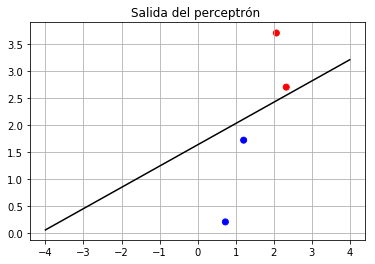
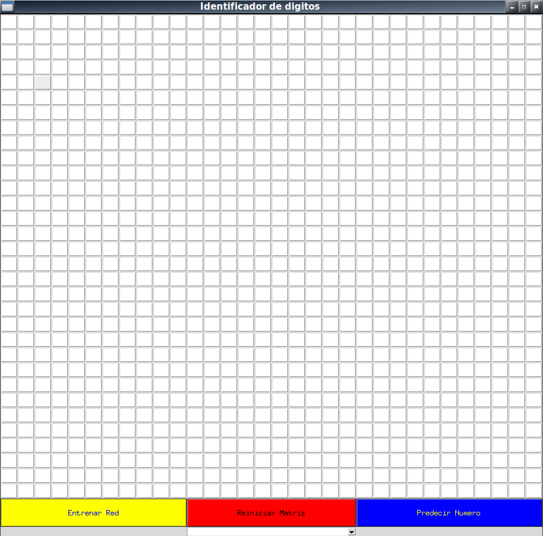
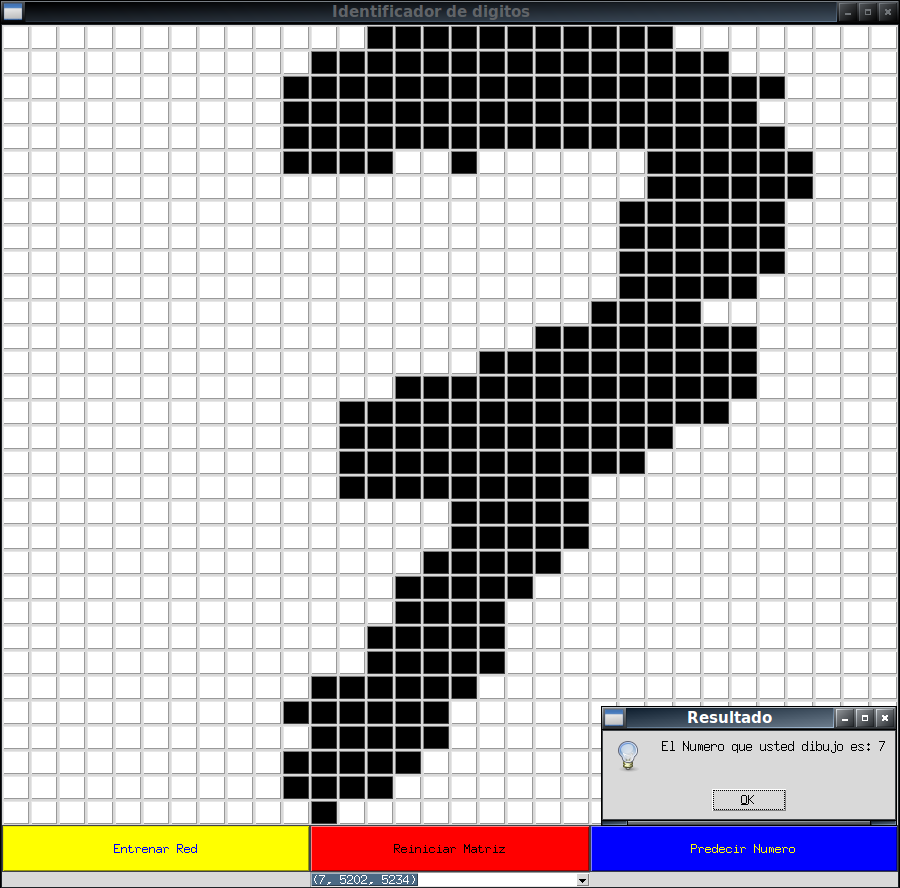

<p align="center">
   
</p>

# Identificador de Dígitos I.A

### Proyecto I.A
**Alumno:** Frank Montalvo Ochoa <br/>

## Redes Neuronales Artificiales

Las redes neuronales artificiales están conformadas por un conjunto de nodos interconectados entre si llamados neuronas artificiales o perceptrón, esta red busca imitar el comportamiento de su homologo biológico.
Dentro de esta red cada nodo esta conectado con otro a través de enlaces; cada uno de estos enlaces tiene un peso con el cual multiplican el valor de la salida de su predecesor, a través de estas operaciones se puede incrementar o disminuir el estado de activación de las neuronas adyacentes. Cada una de las neuronas puede contar con una función de activación a su salida para imponer un limite a alcanzar antes de que esta se propague a la siguiente neurona.

## Perceptrón
Se trata de un modelo matemático simple el cual busca imitar el comportamiento de una neurona.

<p align="center">
   
</p>

## Ejemplo de código de un perceptrón en Python:

```python
import matplotlib.pyplot as pp

class Perceptron:

	def __init__(self, entrada, delta, peso, bias, alfa):
		self._entrada = entrada
		self._delta = delta
		self._peso = peso
		self._bias = bias
		self._alfa = alfa
		self.entrenar(self._entrada, self._delta, self._peso, self._bias, self._alfa)

	def entrenar(self, x, d, w, bias, alfa):
		idx = 0
		cont = 0
		continua = True
		while continua:
			if idx >= len(x):
				continua = False
			else:
				n = self.n(w, x[idx], bias)
				f_n = self.f_n(n)
				error = self.error(d[idx], f_n)
				print('X:', x[idx], '||', 'W:', w, '||', 'f(', n, ') = ', f_n,\
                                      '||', 'Delta:', d[idx], '||', 'Error:', error)
				if error != 0:
					w = self.ajusta_weight(w, alfa, error, x[idx])
					bias = self.ajusta_bias(bias, alfa, error)
					print('W(', 't+'+str(cont + 1) ,'):', w, '||', 'Bias(', 't+'+str(cont + 1) ,'):', bias)
					idx = 0
					cont += 1
				else:
					idx += 1

		print('Resultado:')
		print('W:', w, '||', 'Bias:', bias)
		xd, f_x = self.recta(self.x_y(w, bias))
		self.graficar(x, d, xd, f_x)

	def n(self, w, x, bias):
		n_i = []
		for i in range(len(w)):
			n_i.append(float(w[i] * x[i]))
		return float("{0:.4f}".format((sum(n_i) + bias)))

	def f_n(self, n):
		if n > 0:
			return 1
		else:
			return 0

	def ajusta_weight(self, w_j, alfa, error, x):
		w_i = []
		for i in range(len(w_j)):
			w = w_j[i] + alfa * error * x[i]
			w_i.append(float("{0:.4f}".format(w)))
		return w_i

	def ajusta_bias(self, bias, alfa, error):
		return float("{0:.4f}".format((bias + alfa * error)))

	def error(self, d, f_n):
		return (d - f_n)

	def x_y(self, w, bias):
		xy = []
		for i in range(len(w)):
			if(i%2 == 0):
				xy.append((float("{0:.4f}".format(-bias / w[i])), 0))
			else:
				xy.append((0, float("{0:.4f}".format(-bias / w[i]))))
		return xy

	def recta(self, xy):
		x_i = []
		y_i = []
		for i in range(len(xy)):
			x_i.append(xy[i][0])
			y_i.append(xy[i][1])
		m = (y_i[1] - y_i[0]) / (x_i[1] - x_i[0])
		x = []
		f_x = []
		for xd in range(int(x_i[0]), int(y_i[1]) + abs(int(x_i[0]))):
			x.append(xd)
			f_x.append(m * xd - x_i[0] * m)
		return (x, f_x)

	def graficar(self, x_in, d, xd, f_x):
		x = []
		y = []
		for i in range(len(x_in)):
			x.append(x_in[i][0])
			y.append(x_in[i][1])
		pp.scatter(x, y, color=['blue' if i==1 else 'red' for i in d])
		pp.plot(xd, f_x, color='black')
		pp.title('Salida del perceptrón ')
		pp.grid()
		pp.show()


if __name__ == '__main__':
	x = [[0.73, 0.21], [1.21, 1.72], [2.07, 3.7], [2.33, 2.7]]
	delta = [1, 1, 0, 0]
	w = [-0.23, -1.87]
	bias = 1.31
	alfa = 0.91
	perceptron = Perceptron(x, delta, w, bias, alfa)
```

    X: [0.73, 0.21] || W: [-0.23, -1.87] || f( 0.7494 ) =  1 || Delta: 1 || Error: 0
    X: [1.21, 1.72] || W: [-0.23, -1.87] || f( -2.1847 ) =  0 || Delta: 1 || Error: 1
    W( t+1 ): [0.8711, -0.3048] || Bias( t+1 ): 2.22
    X: [0.73, 0.21] || W: [0.8711, -0.3048] || f( 2.7919 ) =  1 || Delta: 1 || Error: 0
    X: [1.21, 1.72] || W: [0.8711, -0.3048] || f( 2.7498 ) =  1 || Delta: 1 || Error: 0
    X: [2.07, 3.7] || W: [0.8711, -0.3048] || f( 2.8954 ) =  1 || Delta: 0 || Error: -1
    W( t+2 ): [-1.0126, -3.6718] || Bias( t+2 ): 1.31
    X: [0.73, 0.21] || W: [-1.0126, -3.6718] || f( -0.2003 ) =  0 || Delta: 1 || Error: 1
    W( t+3 ): [-0.3483, -3.4807] || Bias( t+3 ): 2.22
    X: [0.73, 0.21] || W: [-0.3483, -3.4807] || f( 1.2348 ) =  1 || Delta: 1 || Error: 0
    X: [1.21, 1.72] || W: [-0.3483, -3.4807] || f( -4.1882 ) =  0 || Delta: 1 || Error: 1
    W( t+4 ): [0.7528, -1.9155] || Bias( t+4 ): 3.13
    X: [0.73, 0.21] || W: [0.7528, -1.9155] || f( 3.2773 ) =  1 || Delta: 1 || Error: 0
    X: [1.21, 1.72] || W: [0.7528, -1.9155] || f( 0.7462 ) =  1 || Delta: 1 || Error: 0
    X: [2.07, 3.7] || W: [0.7528, -1.9155] || f( -2.3991 ) =  0 || Delta: 0 || Error: 0
    X: [2.33, 2.7] || W: [0.7528, -1.9155] || f( -0.2878 ) =  0 || Delta: 0 || Error: 0
    Resultado:
    W: [0.7528, -1.9155] || Bias: 3.13




Como se puede observar en el anterior ejemplo el perceptrón es capaz de separar linealmente un conjunto de datos dado, aun que cabe mencionar que si los datos de entrada no son linealmente separables no se podrá garantizar que esta converja, para estos casos es necesario emplear más de un perceptrón para permitir su aprendizaje.

## Interfaz Grafica del Usuario 

<p align="center">
   
</p>

<p align="center">
   
</p>
